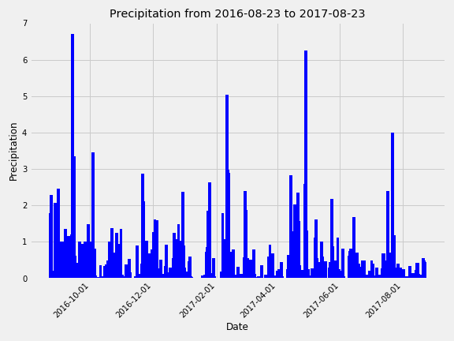
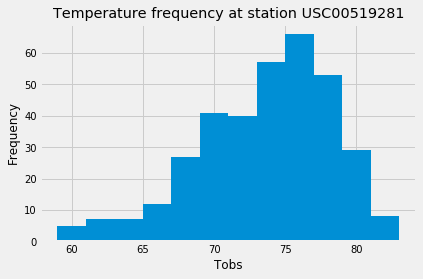
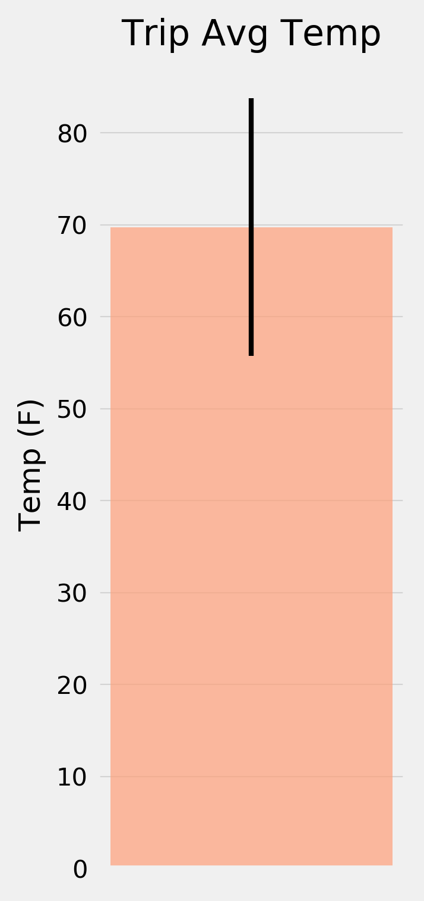

# Hawai Weather Analysis 

## Description 

This project explores  Honolulu, Hawaii climate to understand its precipitation and temperature patterns and render information gathered on API Flask

## Technologies 
- SQLAlchemy 
- ORM queries
- Panda
- Matplotlib
- HTML
- Flask
- sQLite 

## Data Exploration 

Utilized Pandas for Climate Data Analysis and Matplotlib for plotting visualizations 

## Visualizations 

### Bar Graph displaying 12 Month  Data Precipitation

### Histogram with Total Number of Stations

### Bar Chart displaying minimum, maximum and average temperature 

## Climate App

Used FLASK to jsonify to convert API data into a valid JSON response object.

